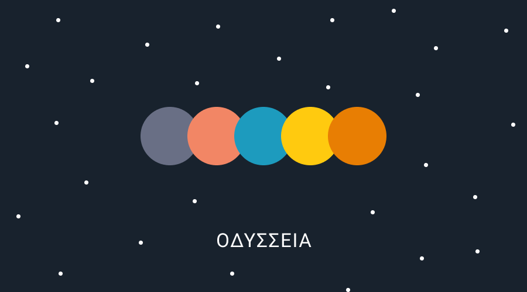

# Odysseia


## Environment

```
Mint: 0.14.2
SwiftGen: 6.4.0
```

### Setup

mint
> $ mint bootstrap

SwiftGen
> $ mint run swiftgen

gem
> $ bundle install

### Development

generamba
> generamba gen <TemplateName> swifty_viper
