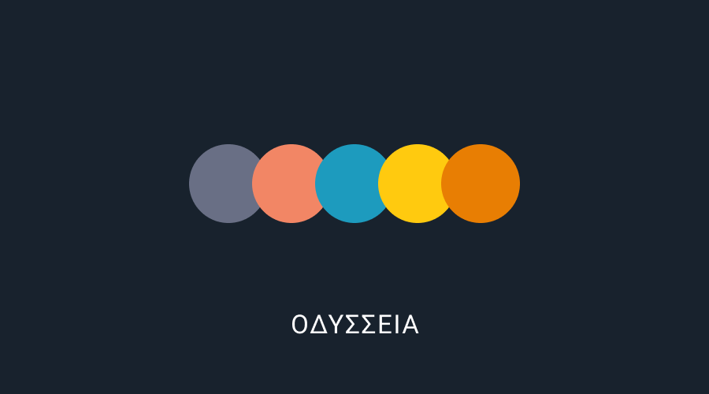

# Odysseia


<a href="https://apps.apple.com/jp/app/id1539914583"></a>

## Preview

|List|Detail|Setting|About|
|:-|:-|:-|:-|
|||||

## Environment

```
Mint: 0.14.2
SwiftGen: 6.4.0
```

### Setup

mint
> $ mint bootstrap

SwiftGen
> $ mint run swiftgen

gem
> $ bundle install

### Development

generamba
> generamba gen <TemplateName> swifty_viper
